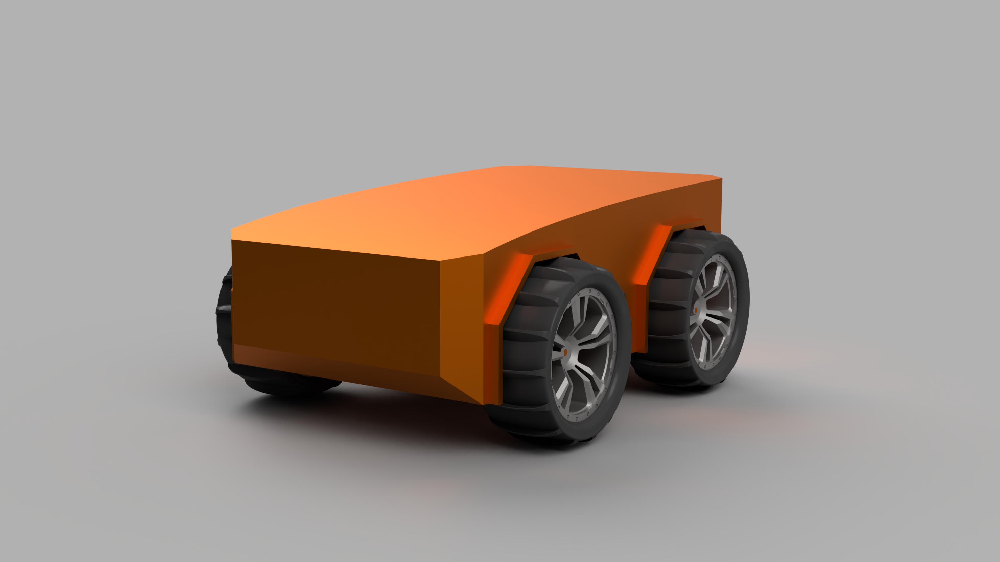
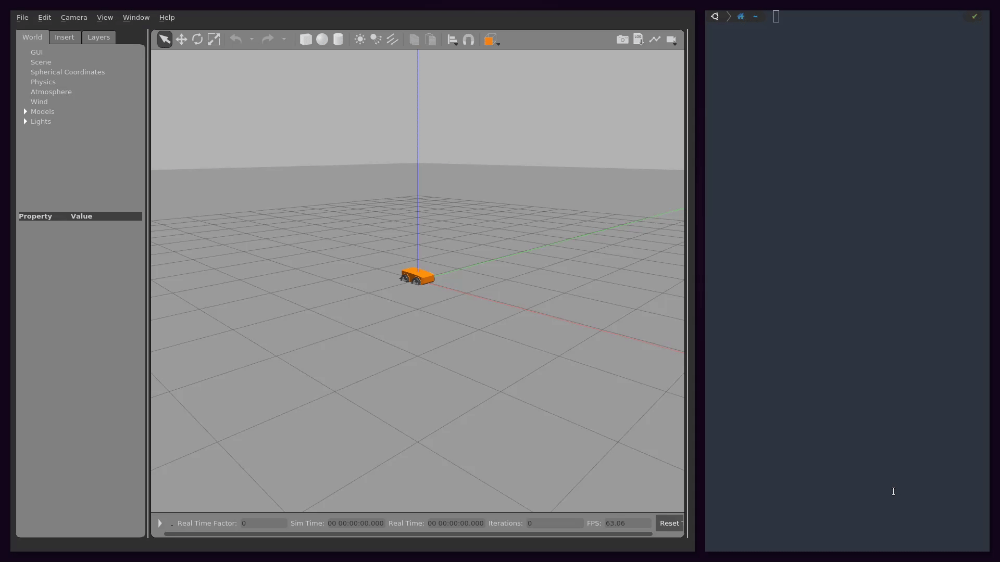

# Four Wheel Skid Drive

Catkin Workspace for my own Four Wheel Skid Drive Simulation.
The packages in this workspace contains URDF Description and Controller for the robot.

<center></center>

</br>


## Simulation

This repository is a catkin-workspace itself, therefore it can be cloned anywhere. To start the simulation in Gazebo do the below steps. [It is expected that all the required packages are already installed.]


```bash
git clone https://github.com/nikh1508/skid4wd_ws
cd skid4wd_ws
source /opt/ros/melodic/setup.zsh # change according to your ROS version
catkin_make
source devel/setup.zsh # or setup.bash | depending on the shell you use

# Finally launch the simulation
roslaunch skid4wd_description sim_with_controller.launch
```


The simulation is started in paused state. Resume the simulation by clicking on the play button on the lower panel in Gazebo. 


To avoid sourcing the `setup.zsh` files everytime you open a new terminal, copy these lines to your .zshrc or .bashrc :

```bash
source /opt/ros/melodic/setup.zsh # or setup.bash | depending on the shell you use
source {path to skid4wd}/devel/setup.zsh
```


To steer the robot you can use `teleop_twist_keyboard` or `rqt_robot_steering`. To launch `rqt_robot_steering` run this on another terminal :

```bash
roslaunch skid4wd_description rqt_steering.launch
```


<center></center>

</br>


## Visualize in RViz


To start RViz with proper configuration use the launch file provided. Make sure that the Gazebo simulation is unpaused, or RViz will give TF errors.

```bash
roslaunch skid4wd_description rviz.launch
```

 

<center></center>

